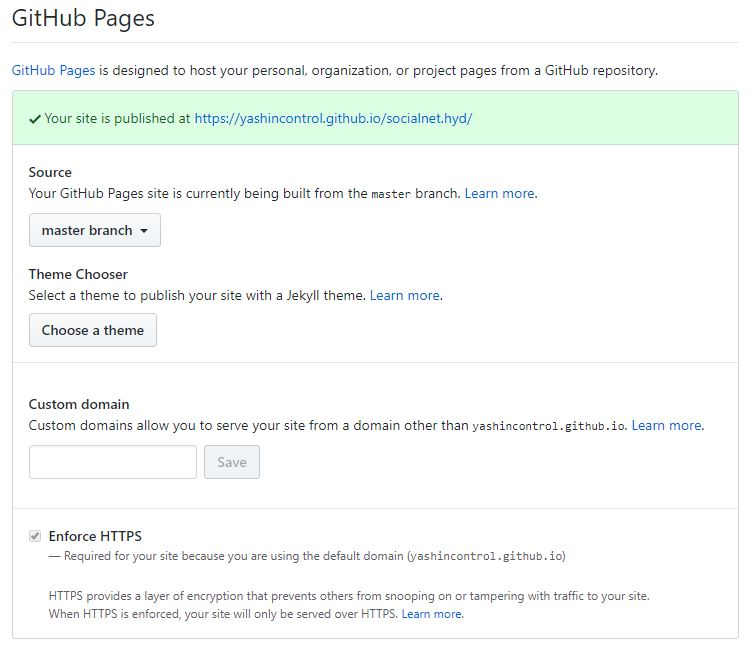

# socialnet.hyd (https://yashincontrol.github.io/socialnet.hyd/)

## 1. Fork this repo on github

Pretty much everything is in `index.html` with some key configuration at the top.

## 2. Create a registration form on Google Forms

Ours asks for:

- Business Name
- Business Email Address
- Physical Business Address
- Description of where the funds will go and why they're needed
- Ketto Link
- Allow funders to avail discounts

Get the **Share URL** for the form by clicking **Send** and the **Link** icon:


Put this in the **configuration** section of `index.html` as the value of `REGISTER_FORM_URL`.

## 3. Create another spreadsheet to use as your database of registered businesses

It **MUST** have the following columns, in this order:

- `Business Name`
- `Location`
- `Description`
- `GoFundMe URL`

Get the `id` portion of the URL from here:


Put this in the **configuration** section of `index.html` as the value of `SPREADSHEET_ID`.

## 4. When people register, verify them and add them to the sheet.

They will automatically show up on your landing site.

## 5. Host your site with GitHub pages



## 6. You're live!

Optionally setup analytics with the following configuration settings in `index.html`:

```javascript
var GOOGLE_ANALYTICS_ID = '_______';
var FULL_STORY_ORG = '_______';
var FULL_STORY_NAMESPACE = '_______';
```
